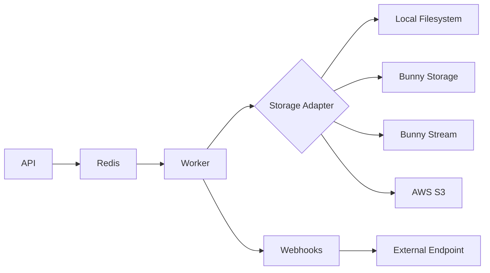

# FFmpeg Command API (Burrowcode)

A distributed API for running FFmpeg commands asynchronously with reliable webhook delivery and pluggable storage adapters.

## Architecture



| Service      | Description                                                |
| ------------ | ---------------------------------------------------------- |
| **API**      | HTTP interface for submitting commands and checking status |
| **Worker**   | Processes FFmpeg jobs from the queue                       |
| **Webhooks** | Reliable webhook delivery with retries and DLQ             |
| **Redis**    | Message broker and result storage (via asynq)              |

## Quick Start

```bash
# Production
make up

# Development (with hot-reload)
make dev
```

## API Endpoints

| Method | Endpoint            | Description                 |
| ------ | ------------------- | --------------------------- |
| `POST` | `/v1/commands`      | Create a new FFmpeg command |
| `GET`  | `/v1/commands`      | List all commands           |
| `GET`  | `/v1/commands/{id}` | Get command status          |
| `GET`  | `/health`           | Health check                |
| `GET`  | `/openapi.json`     | OpenAPI specification       |

## Examples

### Create a Thumbnail

```bash
curl -X POST http://localhost:8080/v1/commands \
  -H "Content-Type: application/json" \
  -d '{
    "input_files": {
      "in_1": "https://example.com/video.mp4"
    },
    "output_files": {
      "out_1": "thumbnail.jpg"
    },
    "ffmpeg_command": "-i {{in_1}} -ss 00:00:05 -vframes 1 {{out_1}}"
  }'
```

Response:

```json
{
  "command_id": "f6bb88cb-83a9-4ea5-b763-078bff3431d4",
  "status": "PENDING"
}
```

### Multiple Outputs

```bash
curl -X POST http://localhost:8080/v1/commands \
  -H "Content-Type: application/json" \
  -d '{
    "input_files": {
      "in_1": "https://example.com/video.mp4"
    },
    "output_files": {
      "out_1": "thumbnail_10s.jpg",
      "out_2": "thumbnail_20s.jpg"
    },
    "ffmpeg_command": "-i {{in_1}} -filter_complex \"[0:v]split=2[first][second];[first]select=gte(t,10)[thumb1];[second]select=gte(t,20)[thumb2]\" -map [thumb1] -frames:v 1 {{out_1}} -map [thumb2] -frames:v 1 {{out_2}}"
  }'
```

### Chained Commands

Use `ffmpeg_commands` (array) to run multiple commands in sequence:

```bash
curl -X POST http://localhost:8080/v1/commands \
  -H "Content-Type: application/json" \
  -d '{
    "input_files": {
      "in_1": "https://example.com/video.mp4"
    },
    "output_files": {
      "out_1": "thumbnail.jpg",
      "out_2": "preview.gif"
    },
    "ffmpeg_commands": [
      "-i {{in_1}} -ss 00:00:17 -vframes 1 {{out_1}}",
      "-i {{in_1}} -vf \"fps=10,scale=320:-1:flags=lanczos\" -t 5 {{out_2}}"
    ]
  }'
```

### With Webhook

```bash
curl -X POST http://localhost:8080/v1/commands \
  -H "Content-Type: application/json" \
  -d '{
    "input_files": {
      "in_1": "https://example.com/video.mp4"
    },
    "output_files": {
      "out_1": "thumbnail.jpg"
    },
    "ffmpeg_command": "-i {{in_1}} -ss 00:00:05 -vframes 1 {{out_1}}",
    "webhook": "https://yourapp.com/webhook"
  }'
```

Webhook payload (delivered with retries):

```json
{
  "command_id": "f6bb88cb-83a9-4ea5-b763-078bff3431d4",
  "status": "SUCCESS",
  "output_files": { ... },
  "original_request": { ... },
  "ffmpeg_command_run_seconds": 0.82,
  "total_processing_seconds": 5.87
}
```

### Check Status

```bash
curl http://localhost:8080/v1/commands/f6bb88cb-83a9-4ea5-b763-078bff3431d4
```

## Status Values

| Status       | Description                             |
| ------------ | --------------------------------------- |
| `PENDING`    | Command queued, waiting to be processed |
| `PROCESSING` | Command currently being executed        |
| `SUCCESS`    | Command completed successfully          |
| `FAILED`     | Command failed (check `error` field)    |
| `RETRYING`   | Command failed but will be retried      |

## Request Format

### Required Fields

- `output_files` - Map of output keys to filenames
- `ffmpeg_command` or `ffmpeg_commands` - FFmpeg command(s) with placeholders

### Optional Fields

- `input_files` - Map of input keys to URLs (downloaded before processing)
- `webhook` - URL to POST results when complete (with automatic retries)
- `reference_id` - Your custom ID for tracking

### Placeholders

Use `{{key}}` syntax to reference input and output files:

- `{{in_1}}` - References `input_files.in_1`
- `{{out_1}}` - References `output_files.out_1`

## Storage Adapters

The worker supports multiple storage backends for output files. Set `STORAGE_ADAPTER` to choose:

### File (default)

Saves outputs to the local filesystem.

| Variable           | Default              | Description            |
| ------------------ | -------------------- | ---------------------- |
| `STORAGE_ADAPTER`  | `file`               | Must be "file"         |
| `OUTPUT_DIR`       | `/tmp/ffmpeg-output` | Local output directory |
| `STORAGE_BASE_URL` | ``                   | Optional URL prefix    |

### Bunny Storage

Uploads to Bunny Edge Storage (CDN-backed object storage).

| Variable                      | Default                | Description                        |
| ----------------------------- | ---------------------- | ---------------------------------- |
| `STORAGE_ADAPTER`             | -                      | Must be "bunny-storage"            |
| `BUNNY_STORAGE_ZONE`          | -                      | Storage zone name (required)       |
| `BUNNY_STORAGE_KEY`           | -                      | Storage zone access key (required) |
| `BUNNY_STORAGE_ENDPOINT`      | `storage.bunnycdn.com` | Storage endpoint                   |
| `BUNNY_STORAGE_PATH_PREFIX`   | ``                     | Optional path prefix               |
| `BUNNY_STORAGE_PULL_ZONE_URL` | ``                     | CDN URL for public access          |

### Bunny Stream

Uploads videos to Bunny Stream (video hosting with transcoding).

| Variable                  | Default | Description                  |
| ------------------------- | ------- | ---------------------------- |
| `STORAGE_ADAPTER`         | -       | Must be "bunny-stream"       |
| `BUNNY_STREAM_LIBRARY_ID` | -       | Stream library ID (required) |
| `BUNNY_STREAM_API_KEY`    | -       | Stream API key (required)    |

Returns: Video GUID (for use with Bunny Stream player/CDN)

### S3

Uploads to AWS S3 or S3-compatible storage (MinIO, Cloudflare R2, etc.).

| Variable          | Default     | Description                            |
| ----------------- | ----------- | -------------------------------------- |
| `STORAGE_ADAPTER` | -           | Must be "s3"                           |
| `S3_BUCKET`       | -           | Bucket name (required)                 |
| `S3_REGION`       | `us-east-1` | AWS region                             |
| `S3_ENDPOINT`     | ``          | Custom endpoint (for S3-compatible)    |
| `S3_ACCESS_KEY`   | -           | Access key ID (required)               |
| `S3_SECRET_KEY`   | -           | Secret access key (required)           |
| `S3_PATH_PREFIX`  | ``          | Optional path prefix                   |
| `S3_PUBLIC_URL`   | ``          | Public URL base (if different from S3) |

## Environment Variables

### API Service

| Variable               | Default          | Description                            |
| ---------------------- | ---------------- | -------------------------------------- |
| `REDIS_ADDR`           | `localhost:6379` | Redis server address                   |
| `PORT`                 | `8080`           | HTTP server port                       |
| `TASK_MAX_RETRY`       | `2`              | Max retries for failed FFmpeg tasks    |
| `TASK_TIMEOUT_MINUTES` | `30`             | Timeout per FFmpeg task                |
| `TASK_RETENTION_HOURS` | `24`             | Hours to retain completed task results |

### Worker Service

| Variable                  | Default            | Description                                             |
| ------------------------- | ------------------ | ------------------------------------------------------- |
| `REDIS_ADDR`              | `localhost:6379`   | Redis server address                                    |
| `WORK_DIR`                | `/tmp/ffmpeg-jobs` | Temporary working directory                             |
| `CONCURRENCY`             | `2`                | Number of concurrent FFmpeg workers                     |
| `STORAGE_ADAPTER`         | `file`             | Storage adapter (file, bunny-storage, bunny-stream, s3) |
| `WEBHOOK_MAX_RETRY`       | `5`                | Max retries for webhook delivery                        |
| `WEBHOOK_RETENTION_HOURS` | `72`               | Hours to retain webhook tasks                           |

Plus adapter-specific variables (see Storage Adapters section above).

### Webhooks Service

| Variable          | Default          | Description                                 |
| ----------------- | ---------------- | ------------------------------------------- |
| `REDIS_ADDR`      | `localhost:6379` | Redis server address                        |
| `CONCURRENCY`     | `10`             | Number of concurrent webhook workers        |
| `HTTP_TIMEOUT`    | `10`             | Timeout for webhook HTTP requests (seconds) |
| `MAX_RETRY`       | `5`              | Max retries before moving to DLQ            |
| `RETENTION_HOURS` | `72`             | Hours to retain completed/failed tasks      |
| `HEALTH_PORT`     | `8081`           | Health check endpoint port                  |

## Development

### Prerequisites

- Docker and Docker Compose
- Go 1.25+ (for local development without Docker)
- Make

### Commands

| Command              | Description                            |
| -------------------- | -------------------------------------- |
| `make build`         | Build production Docker images         |
| `make up`            | Start production containers            |
| `make up-d`          | Start production containers (detached) |
| `make down`          | Stop containers                        |
| `make dev`           | Start with hot-reload (Air)            |
| `make dev-d`         | Start with hot-reload (detached)       |
| `make dev-down`      | Stop dev containers                    |
| `make tidy`          | Run `go mod tidy` on all services      |
| `make logs`          | Tail all logs                          |
| `make logs-api`      | Tail API logs only                     |
| `make logs-worker`   | Tail worker logs only                  |
| `make logs-webhooks` | Tail webhooks logs only                |
| `make health`        | Check health endpoints                 |
| `make clean`         | Remove containers, volumes, images     |
| `make redis-cli`     | Open Redis CLI                         |

### Project Structure

```
ffmpeg-service/
├── api/                    # HTTP API service
│   ├── main.go
│   ├── openapi.yaml        # OpenAPI 3.1 specification
│   ├── oas/                # Generated code (ogen)
│   ├── go.mod
│   ├── Dockerfile          # Production build
│   ├── Dockerfile.dev      # Development with Air
│   └── .air.toml           # Air config
├── worker/                 # FFmpeg processing worker
│   ├── main.go
│   ├── adapters/           # Storage adapters
│   │   ├── adapter.go      # Interface + factory
│   │   ├── file.go         # Local filesystem
│   │   ├── bunny_storage.go# Bunny Edge Storage
│   │   ├── bunny_stream.go # Bunny Stream
│   │   └── s3.go           # S3/S3-compatible
│   ├── go.mod
│   ├── Dockerfile
│   ├── Dockerfile.dev
│   └── .air.toml
├── webhooks/               # Webhook delivery service
│   ├── main.go
│   ├── go.mod
│   ├── Dockerfile
│   ├── Dockerfile.dev
│   └── .air.toml
├── docker-compose.yml      # Production compose
├── docker-compose.dev.yml  # Development compose (hot-reload)
└── Makefile
```

### Docker Files

| File             | Purpose                                                                   |
| ---------------- | ------------------------------------------------------------------------- |
| `Dockerfile`     | Production - multi-stage build, minimal Alpine image with compiled binary |
| `Dockerfile.dev` | Development - Go toolchain + Air for hot-reload, source mounted as volume |

## Webhook Reliability

Webhooks are delivered via a dedicated service with:

- **Automatic retries** with exponential backoff (default: 5 attempts)
- **Dead-letter queue** for failed webhooks after max retries
- **Configurable timeouts** to handle slow endpoints
- **Independent scaling** from FFmpeg processing

This ensures webhook delivery doesn't block video processing, and temporary endpoint failures don't result in lost notifications.
